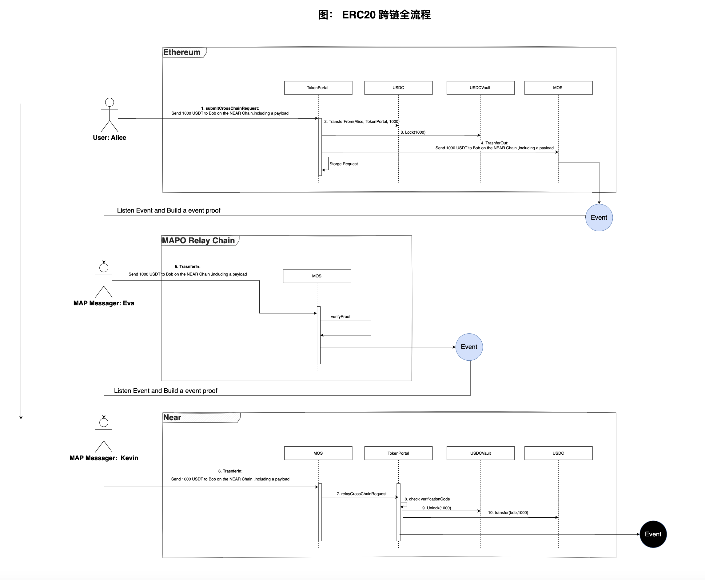

# ACCP20-ERC20资产跨链协议

## 序言

编号：MKash01
作者：0xqige.eth

## 摘要

本文档描述了一个基于 MAP Protocol 的 ERC20 Token 跨链设计方案。ACCP是 “Asset Cross-Chain Protocol” 的缩写。该方案旨在确保资产跨链的安全性、防止双花攻击，并提供完备的协议接口描述。

## 动机

MAP Protocol 作为跨链协议，天然具有 Token Bridge 功能。资产跨链属于跨链的强需求，项目方在使用 MAP Protocol 作为消息跨链底座时，80%以上都会涉及资产跨链。与其项目方重复造轮子，还不如在 MAP Protocol 生态中携手创建资产跨链标准组件。旨在在确保资产跨链的安全性、提高项目方接入的便利性和统一性。繁荣生态，共识共建。

## 规范

**链间资产映射**

为确保资产在跨链过程中的安全性，我们将在源链（Source Chain）和目标链（Target Chain）上分别创建相应的代币Vault合约。在源链上，将有原始ERC20代币锁定在Vault中。而在目标链上，将从 Vault 中解锁目标资产。锁定和解锁之间的关联将由MAP Protocol提供的跨链验证网络来确保。

**跨链操作流程**


 [查看](https://viewer.diagrams.net/index.html?tags=%7B%7D&highlight=0000ff&edit=_blank&layers=1&nav=1&title=Token%E8%B7%A8%E9%93%BE#Uhttps%3A%2F%2Fdrive.google.com%2Fuc%3Fid%3D1KXISWN7xgju-mcY8VdWaHirGmyqH7bxa%26export%3Ddownload)最新流程图。

1. **请求跨链**：用户通过调用源链上的 TokenPortal  合约的请求跨链函数。
2. **转移资产**：TokenPortal  合约从用户钱包中转移资产，这此之前需要用户授权USDC给TokenPortal 合约。
3. **锁定资产：** TokenPortal  将源链资产锁入到 Vault 合约中。
4. **提交跨链请求**：TokenPortal  将跨链消息提交给MAP全链服务层（MOS），附带跨链事件的相关信息以及校验码。并记录跨链事件记，方便异常时重新发送请求。
5. **中继链传递跨链事件**： MOS 链间通讯组件 Messenger 在检测到该事件后，将跨链事件和事件证明信息一起传输到中继链的 MOS 中，一旦经过 Light Client 验证Proof 即可生成跨链到目标链事件(5)。
6. **目标链接受请求**： MOS 链间通讯组件 Messenger 在检测到该事件(5)后,将跨链事件和事件证明信息一起传输到目标链的 MOS 合约中，一旦经过 Light Client 验证Proof 即可继续执行合约。
7. **响应跨链请求**： MOS 主动调用 TokenPortal 合约的 relayCrossChainRequest 函数，传递跨链请求数据。
8. **二次验证**：TokenPortal  利用校验码校验跨链请求数据是否完备，并不允许重新响应相同请求。
9. **释放资产**： TokenPortal 从 Vault 中解锁资产。
10. **发送资产**：Token Portal 将解锁资产发放给资产接收人。


### 流动性说明

请求资产跨链后，在目标链能否成功释放资产，这取决于目标链 TokenVault 中流动性是否充裕。如果流动性枯竭，将无法释放资产。为解决此问题，有三种方案可选：

方案一：原路回退跨链请求，这势必增加了资产跨链的复杂性，且面临 DOS 攻击风险。

方案二：需要用户在目标链流动性充裕后在源链上通过 TokenPortal 合约 retry 一次跨链请求。该方案在流动性紧张或不稳定时，retry 不能确保成功，影响用户体验。

方案三：发放兑换票据，流动性不足时跨链请求保持成功，释放的不是目标链真实资产，而是目标链上的资产兑换凭据 Token。使用凭据 Token可以 1:1 兑换真实资产。该方案确保跨链请求不受流动性影响，用户也能在流动性充裕时立即从  TokenVault 兑换资产。

### 接口描述

```Solidity

interface ICrossChainRequestReceiver{

	function onCrossChainRequestReceived(
		 uint256 sourceChainId, bytes32 recipient,
     bytes32 sourceAssetAddress,
	   uint256 amount,
	   bytes calldata payload
	);
}

/**
  @notice 发送资产跨链请求
*/
interface ITokenPortalOut {

		/**
		  @notice 请求锁定资产以进行跨链操作
		  @dev    在提交请求时还需要支付原子资产作为 relayerFee
		  @param  targetChainId        目标链ID
		  @param  targetChainRecipient 目标链接收地址
		  @param  sourceAssetAddress   源链资产地址
		  @param  amount         跨链数量
		  @param  salt           作为跨链请求的一部分，便于生生成不同的 ReqID
		  @param  requestReceiver 如果不为空，则在目标链的unclok中发送资产给 targetChainRecipient 后将立即主动执行一次该执行 requestReceiver 合约的 onCrossChainRequestReceived 方法。
		  @param  payload   额外携带的数据包，用作 `requestReceiver.onCrossChainRequestReceived`的`payload`数据填充.
		  @param  payloadGasLimit 指定 onCrossChainRequestReceived 方法的Gas开销上线。该值可以通过在目标链模拟执行 relayCrossChainRequest 计算。
		  @param  返回本次跨链请求事件 verificationCode
		*/
		function submitCrossChainRequest(
		 uint256 targetChainId, bytes32 targetChainRecipient,
		 bytes32 sourceAssetAddress, uint256 amount,bytes32 salt,
	   bytes32 requestReceiver, bytes calldata payload,uint256 payloadGasLimit) 
	   returns(bytes32 verificationCode) payable;

			/**
			 @notice  重发请求
			 @dev 只允许提交过的请求重新发送，重新发送的目的是方便目标链重新处理事情。
			 注意：目标链将确保 verificationCode 只会处理一次。
			*/
		 function retryCrossChainRequest(bytes32 verificationCode);

}

/**
  @notice 响应资产跨链请求
*/
interface ITokenPortalIn {

			/**
			@notice 执行解锁资产以完成跨链操作
			@dev    该方法的msg.sender 只允许是 MOS 合约或者空地址。
			 1. msg.sender 为空地址，说明是链下模拟执行。
			 2. 注意 MOS 合约地址变更，则将无法正常工作。
			 3. 必须确保 verificationCode 只会被处理一次且验证数据的完备性。
		  @param  sourceChainId   		源链ID
		  @param  recipient       		接收地址
		  @param  sourceAssetAddress  源链资产地址
		  @param  amount          跨链数量
		  @param  salt            作为跨链请求的一部分
		  @param  requestReceiver 如果不为空，则在目标链的unclok中发送资产给 targetChainRecipient 后将立即主动执行一次该执行 requestReceiver 合约的 onCrossChainRequestReceived 方法。
		  @param  payload   额外携带的数据包，用作 `requestReceiver.onCrossChainRequestReceived`的`payload`数据填充.
		  @param verificationCode 校验码，用于校验数据的完整性，它是跨链请求消息的SHA3哈希值。
		*/
		function relayCrossChainRequest(
		 uint256 sourceChainId, bytes32 recipient,
     bytes32 sourceAssetAddress,
	   uint256 amount,bytes32 salt,
	   bytes32 requestReceiver, bytes calldata payload,
	   bytes32 verificationCode);

	   /**
	     @notice 在目标链上查询指定跨链请求是否已完成
	   */
	   function isRequestCompleted(bytes32 verificationCode) view returns(bool);
}


interface ITokenVault {

		/**
		  @notice 返回 vault 中管理的底层资产合约地址
		*/
	  function underlyingToken() view returns(address);

		/**
		  @notice 返回对应的等值可兑换票据Token合约地址
		  @dev 只有 Vault 有权限 Mint 和 Burn 操作 ConvertibleToken
		*/
	  function convToken() view returns(address);

		/**
		 * @notice 查询 locker 的锁定数量
		*/
		function balanceOf(address locker) view returns(uint256 amount);
		/**
		  @notice 请求锁定的资产数量
		  @dev  锁定资产将记录在
		*/
	  function lock(uint256 amount);

		/**
		  @notice 请求解锁的资产数量
		  @param to      解锁资产接受地址，不能为空地址
		  @param amount  解锁数量
		  @param recvConvertibleToken  是否同意在流动性不足时接收等值的可转换票据
		  @return convTokens 返回在流动性不足时有多少Token被使用可转换票据替代。
		*/
		function unlock(address to, uint256 amount,bool recvConvertibleToken) returns(uint256 convTokens);

		/**
		  @notice 将 ConvertibleToken 兑换成真实资产
		*/
		function swapConvertibleTokenToAsset(uint256 amount);
}

interface IConvertibleToken is IERC20Permit {
	 function mint(address to, uint256 amount);
	 function burn(uint256 amount);
}

```

## 基本原理

MAP Protocol的轻节点验证网络采用独立自我验证机制和即时验证的特点，可以确保资产跨链的安全性。跨链OrderID和 verificationCode  的唯一性可以防止用户在源链和目标链上同时使用相同的资产。此外，Maintainer 是独立的跨链程序，负责更新轻节点的状态，Light-Client 机制确保Maintainer的恶意攻击无效。

本协议是在 MAP Protocol 底层协议之上构建的应用层标准，规范了 ERC20 资产跨链的交互流程。


## 安全考虑

作为跨链标准组件，该协议不允许加入管理员权限。使用跨链OrderID和 verificationCode  的唯一性可以防止用户在源链和目标链上同时使用相同的资产。


## 结论

本文档提供了一个基于MAP Protocol的ERC20 Token跨链设计方案。该方案确保了资产跨链的安全性、防止双花攻击，并提供了完备的协议接口描述。通过实现此设计方案，可以为 MAP Protocol 生态提供一个可靠且高效的ERC20 Token跨链解决方案。