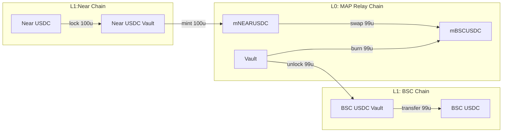
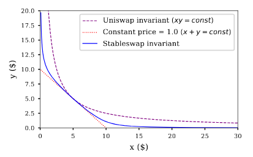
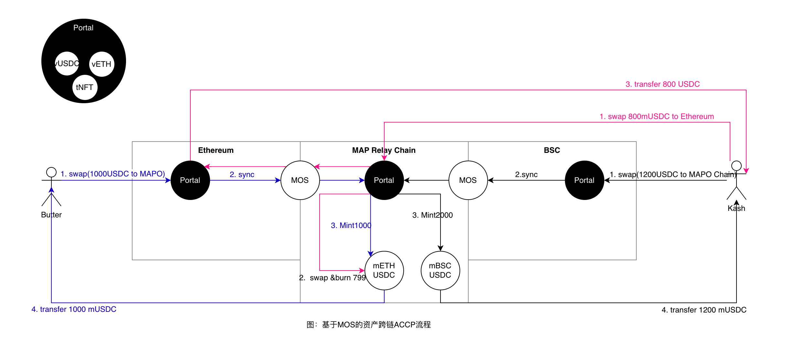
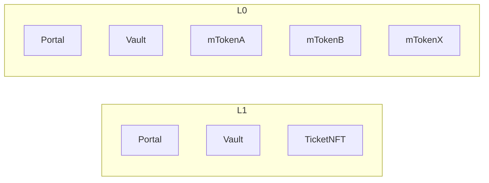
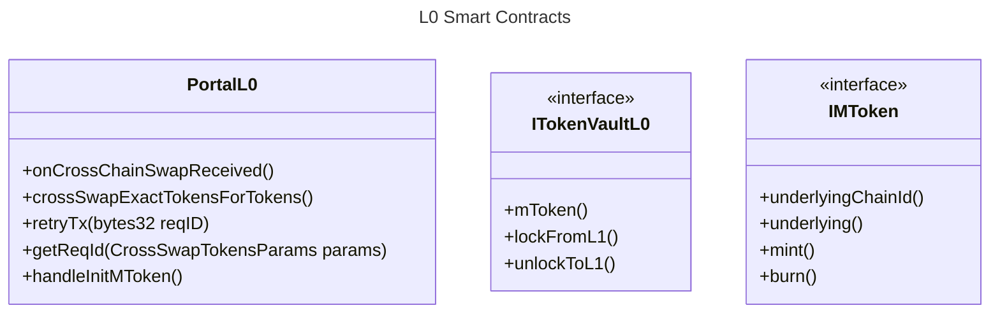
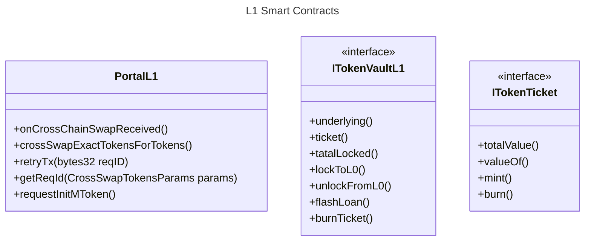

# ACCP20-ERC20资产跨链协议

## 序言

编号：MKash01
作者：0xqige.eth

## 摘要

本文档描述了一个基于 MAP Protocol 的 ERC20 Token 跨链设计方案。ACCP是 “Asset Cross-Chain Protocol” 的缩写。该方案旨在确保资产跨链的安全性、防止双花攻击、共享流动性并提供完备的协议接口描述。

## 动机

MAP Protocol 作为跨链协议，天然具有 Token Bridge 功能。资产跨链属于跨链的强需求，项目方在使用 MAP Protocol 作为消息跨链底座时，80%以上都会涉及资产跨链，且都会面临跨链流动性再平衡和激励问题。 与其生态项目方重复造轮子，不如在 MAP Protocol 生态中携手创建资产跨链基础设施 ACCP。ACCP 旨在在确保资产跨链的安全性、提高项目方接入的便利性和统一性、共享流动性。繁荣生态，共识共建，让 ACCP 成为跨链的模块化组件。

## 基本原理

将所有L1和L2链的 ERC20 分别在 MAP Relay Chain（简称 L0 链）1比1映射一个 ERC20 ，简称 mToken。例如 Ethereum 链的 XYZ Token 映射到  L0 的 ERC20 mΞXYZ 。

然后在 L0 创建和Curve协议一样的稳定币兑换算法来交易相同价值的 mToken，理想情况下 mΞXYZ  和 mBSCXYZ 兑换率是 1:1 。

使用 AMM 机制解决流动性，使用  ACCP 标准提供统一资产跨链标准。项目方可自愿成为 AMM 流动性提供者，任何用户也可自由提供流动性。

MAP Protocol的轻节点验证网络采用独立自我验证机制和即时验证的特点，可以确保资产跨链的安全性。跨链OrderID和 reqID 的唯一性可以防止用户在源链和目标链上同时使用相同的资产。此外，Maintainer 是独立的跨链程序，负责更新轻节点的状态，Light-Client 机制确保Maintainer的恶意攻击无效。

本协议是在 MAP Protocol 底层协议之上构建的应用层标准，规范了 ERC20 资产跨链的交互流程。

## 使用场景

1. 项目方在  L0 内在解决流动性再平衡问题。
2. 第三方可创建形式多样的流动性质押服务，发展跨链 DeFI 衍生品。
3. 为下一代第 0 层 DeFi 提供基础设施。

## 规范

### 资产跨链

为确保资产在跨链过程中的安全性，我们将在源链（Source Chain）和 目标链（Target Chain）部署 Vault 合约， 在 L0 上分别创建相应的代币的映射Token mToken。

资产跨链拆分为两个环节：跨入和跨出：

**跨入：**在源链上将原始 ERC20 代币锁定在 Vault 合约中。再在  L0 上 1:1 铸造 mToken 。

**跨出**: 在L0上将持有的 mToken兑换成目标链的 mToken，然后销毁，继而在目标链 Vault 合约中解锁对应数量的目标资产。

锁定和解锁之间的关联将由 MAP Protocol 提供的跨链验证网络来确保。跨链可兑换数量由Swap流动性确定。

Valut职能是负责锁定和解锁底层资产，以及在L0中铸造和销毁mToken。

mToken的用途是将底层资产的流动性映射到 L0 链，在L0中可真实的进行多链资产Swap。



### 流动性说明

在 L0 拥有 mToken 则拥有了兑换其他链资产的能力。当 MAP 生态中的项目方都将资产通过 ACCP 协议跨链，将提高资本利用率。

当出现挤兑时，将面临流动性枯竭无法解锁资产问题。为解决此问题，采用两个并行发方案来缓解流动性：

1. Swap： 跨链视为不同链上的同类资产兑换，类似于不同稳定币间的兑换交易。由算法决定 mToken 兑换价格，具体见Swap算法。
2. Ticket：用户可选择不使用跨链兑换，而是选择兑换成一张冻结 7 天的纸票（paper ticket），到期后可在目标链可以 1:1 兑换底层资产，但只有在 Vault 流动性充裕时成功兑换，支持部分兑换，也可以在 NFT 市场折价出售与流通。

通过组合 mToken、AMM 和Ticket，让生态共享流动性，解决了如何获取流动性和如何使用流动性问题。

#### Swap算法

Curve 是专门为稳定币设计的 DEX，他改进了自动做市商模型，将稳定币交易对的滑点降低。AACP 也采用已经被验证过的 Curve 稳定币AMM模型，沿用到同一资产在不同链上的兑换中。详见 [Curve AMM](https://alvarofeito.com/articles/curve/) 算法。



### 跨链操作流程



#### 跨入锁仓流程

1. 如上图实例，用户 Butter 在源链（BSC）上发起兑换 1000 USDC 到 MAPO链的请求，Portal 将 1000 USDC 从 Butter 账户中转入 USDC Vault中锁定；
2. Portal 通过 MOS 同步该锁仓消息到 MAPO；
3. MAPO链中的 Portal 接收到锁仓消息后， 1:1 铸造 1000 mUSDCBSC 给用户 Butter。

至此，在 MAPO 链上 Butter 拥有 1000 mUSDC 作为锁仓凭证。同理，用户 Kash 从源链（Ethereum链）上锁仓 1200 USDC，拥有 1200 mUSDCΞ 。

#### 解锁流程

1. 用户 Kash  请求解锁 800 USDC 到目标链（ BSC 链）；
2. Portal 需要通过 Swap 计算兑换800 USDC所需要的 mUSDCΞ 的数量，然后销毁  mUSDCBSC，并将解锁消息通过 MOS 发往目标链；
3. 目标链 Portal 接收到解锁消息后，给用户 Kash 发送 800 USDC。

#### 资产跨链流程

锁仓和解锁，是资产跨链兑换的两部分。从源链锁仓，在目标链解锁，由 MAP Relay Chain 传递跨链消息。 当 Kash 请求从目标链以太坊跨链 800 USDC 到 BSC链时，将自动执行锁仓和解锁，流程如下：

1. 在 Ethereum 链锁定 800 USDC；
2. 在 MAPO 链铸造 800 mUSDCΞ;
3. 在 MAPO 链销毁 799 mUSDCBSC；
4. 在 BSC 链解锁 799 USDC。

### 模块说明



1. **Vault** 有两个职责：
   1. L1负责锁定和解锁底层资产；
   2. L0负责 token 和 mToken 间的 1:1 兑换
   3. 负责传递资产跨链消息。
2. **Portal- L0** 主要职责是为 User 提供跨链操作；
   1. 负责请求跨出资产以及Swap计算；
   2. 负责接收跨链消息的后续处理；
   3. 负责创建 mToken。
3. **Portal- L1** 主要职责是为 User 提供跨链操作；
   1. 负责从普通用户处锁定资产；
   2. 负责处理跨链资产转移给普通用户；
   3. 负责管理可跨链资产；
4. **mToken**: L1资产的流动性在L0中的映射。
5. **TicketNFT**： 在 L1 中可以兑换成底层资产的票据NFT。

### 接口描述





```Solidity

// 所有用户在接收 mToken 或 Token 时需要实现对应的回掉接口。
interface ISwapReceiver{
  function onCrossChainSwapReceived(CrossContext ctx,bytes calldata data);
}

// 跨链请求基本信息
struct CrossContext{
    uint128 sourceChainId  // 请求来源所在链
    uint128 targetChainId // 请求去向
    uint128 nonce        // 请求的随机编号
    uint8   clientVerion //在源链的Portal版本
    bytes32 reqId        //请求ID，拥有校验数据的完整性，具有全局唯一性
}

// 跨链兑换资产参数集
struct CrossSwapTokensParams{
    bytes32 recipient, //目标链接受资产的收款人，如果是合约则必须实    ISwapReceiver接口。
    uint128 amountIn, //兑换输入数量
    uint128 amountOutMin,//兑换输出的最小数量
    uint256 flags ,//设定信息二进制处理，见 FLAGS
    bytes32[] paths, // 资产转移路径
    bytes   data, // 如果允许 hook 调用，则 recipient 必须为合约并实现    ISwapReceiver 接口。
}

enum FLAGS {
   FLAG0
   FLAGS_ALLOW_HOOK_CALL,//允许
   FLAGS_ONLY_TICKET // 使用票据NFT
}


interface ITokenPortal{

 /**
    @notice 跨链兑换资产
    @dev
    1. 将销毁 msg.sender 的 mtoken，需要 msg.sender 先授权转移 mtoken；
    2. 必须检查可兑换数量是否符合要求 ；
    3. 必须检查目标链资产是否是匹配的映射；
    4. 根据 SWAP 算法计算 mtoken 可以兑换的目标链资产数量
    @param  params    Swap请求信息
    @return reqID  该请求ID
  */
  function crossSwapExactTokensForTokens(CrossSwapTokensParams params) external returns(bytes32 reqID);

  /**
    @notice 接收到Swap成 mToken 消息
    @dev 将 1:1 铸造对应的 mtoken。
        1. 根据 SWAP 算法来确定
        2. 如果是需要考虑到其他链，则需要进一步传递消息。
  */
  function onCrossChainSwapReceived(CrossContext ctx,bytes calldata data);

  // 重新发送跨链请求
  function retryTx(bytes32 reqID) external;

  // 读取reqID
  function getReqId(CrossSwapTokensParams params) external view returns(bytes32 reqID);
}


interface ITokenVaultL1 {

  // 返回Vault锁定的底层资产
  function underlying() external view returns(address);

  /**
    @notice 返回对应的等值可兑换票据NFT合约地址
    @dev 只有 Vault 有权限 Mint 和 Burn ticketNFT
  */
  function ticket() external view returns(address);

  /**
   * @notice 查询 token 的锁定数量
  */
  function tatalLocked() external view returns(uint256 amount);

  /**
    @notice 请求锁定指定资产，将在 L0 链1:1获得 mToken
    @dev 锁定后，通过L0的Vault的lockFromL0方法铸造 mToken
  */
  function lockToL0(uint256 amount,address recipient,bytes calldata data);

  /**
    @notice 请求解锁的资产数量
    @dev   该方法只能被 MOS 执行
    @param token   解锁资产
   @param amount  解锁数量
    @param to      解锁资产接受地址，不能为空地址
    @return bTokens 返回在流动性不足时有多少Token被使用可转换票据替代。
  */
  function unlockFromL0(uint256 amount,address recipient,bytes calldata data);

  /**
    @notice 闪电贷
  */
  function flashLoan(address receiver,uint256 amounts,bytes calldata params) external;

  /**
    @notice 将 ticket 兑换成底层资产
  */
  function burnTicket(uint256 amount);
}

interface ITokenVaultL0 {
  function lockFromL0(uint256 amount,address recipient,bytes calldata data);
  function unlockToL1(uint256 amount,bytes32 recipient,bytes calldata data);
}

interface IMToken is IERC20Permit {

  // 返回 mToken 对应的资产所在链ID
  function underlyingChainId external view returns(uint256);

  // 返回 mToken 对应的资产ID
  function underlying() external view returns(bytes32);

  /**
    @notice 铸造mToken
    @dev 只有 Vault 有权限 Mint
  */
  function mint(uint256 amount,address to);

  /**
    @notice 销毁 mToken
    @dev 只有 Vault 有权限 Burn，Burn后将减少TotalSupply。
  */
  function burn(uint256 amount);
}

interface ITokenTicket is IERC721Permit {

  // 返回总底层资产数量
  function totalValue() external returns view(uint256 amount);

  // 返回 id 对应的底层资产数量
  function valueOf(uint255 id) external returns view(uint256 amount);

  /**
    @notice 铸造NFT
    @dev 只有 Vault 有权限 Mint
  */
  function mint(address to, uint256 underlyingValue);

  /**
    @notice 销毁 NFT ，并兑换
    @dev 只有 Vault 有权限 Burn，Burn后将减少TotalSupply。
  */
  function burn(uint256 id, uint256 amount);
}

```

## 安全考虑

作为跨链标准组件，该协议不允许加入管理员权限。使用跨链OrderID和 reqID 的唯一性可以防止用户在源链和目标链上同时使用相同的资产，同时可自由创建 mToken交易对。

## 结论

本文档提供了一个基于MAP Protocol的ERC20 Token跨链设计方案。该方案确保了资产跨链的安全性、防止双花攻击，并提供了完备的协议接口描述。通过实现此设计方案，可以为 MAP Protocol 生态提供一个可靠且高效的ERC20 Token跨链解决方案。
